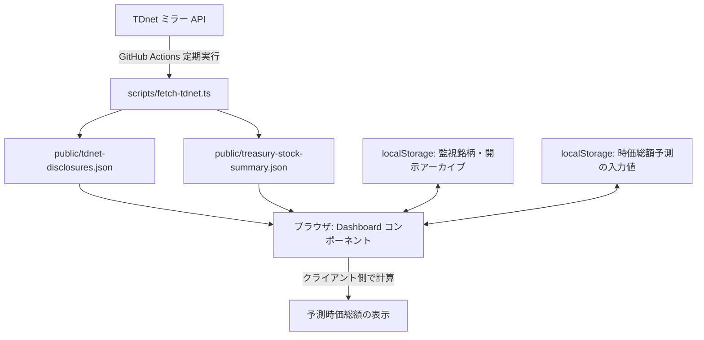
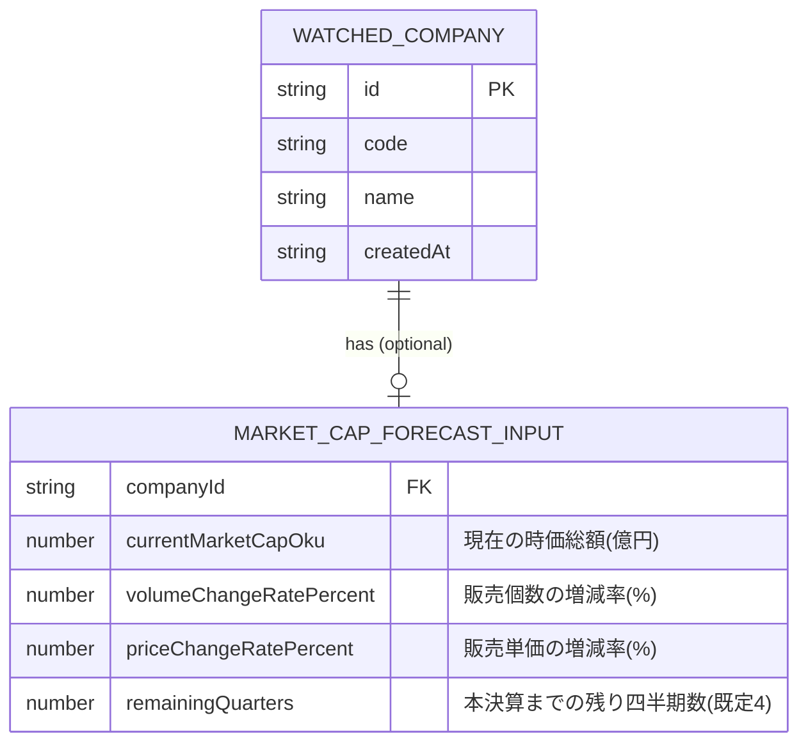
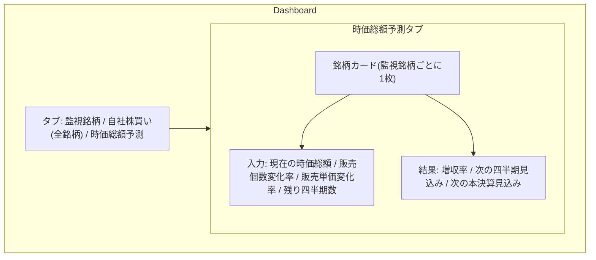

# 機能設計書 (functional-design.md)

## システム構成図



時価総額予測機能は既存のスナップショット取得パイプライン(A〜D)には依存せず、既存の「監視銘柄」データ(localStorage)と、新設する「時価総額予測の入力値」(localStorage)のみをもとに、ブラウザ内で計算が完結する。

## コンポーネント設計

* `src/components/Dashboard.tsx`
  * 既存の「監視銘柄」「自社株買い(全銘柄)」タブに加え、「時価総額予測」タブを追加する
  * 新タブでは監視銘柄(`listWatchedCompanies()`)を一覧し、各社について予測入力フォームと計算結果を表示する
* `src/lib/market-cap-forecast.ts`(新規)
  * 予測入力値の型定義・localStorage 永続化(`watchlist.ts` と同じ `StorageLike` 注入パターン)
  * 増収率・予測時価総額を計算する純粋関数群(UI から独立してユニットテスト可能にする)

## データモデル定義



`MARKET_CAP_FORECAST_INPUT` は `WatchedCompany.id` をキーとする独立した localStorage レコードとして保持し、既存の `WatchedCompany` 型は変更しない(監視銘柄の削除時は対応する予測入力も削除する)。

### 型定義(TypeScript)

```ts
export interface MarketCapForecastInput {
  currentMarketCapOku: number | null;
  volumeChangeRatePercent: number;
  priceChangeRatePercent: number;
  remainingQuarters: number;
}

export interface MarketCapForecastResult {
  revenueChangeRate: number;
  nextQuarterMarketCapOku: number;
  nextQuarterChangeRate: number;
  nextFullYearMarketCapOku: number;
  nextFullYearChangeRate: number;
}
```

## 計算ロジック(ユースケース)

1. 増収率 `r = (1 + volumeChangeRatePercent/100) * (1 + priceChangeRatePercent/100) - 1`
2. 次の四半期時点: `nextQuarterMarketCapOku = currentMarketCapOku * (1 + r)`
3. 次の本決算時点: `nextFullYearMarketCapOku = currentMarketCapOku * (1 + r) ^ remainingQuarters`
4. `currentMarketCapOku` が未入力(null)の場合は計算せず、入力を促すメッセージを表示する

## 画面設計(ワイヤーフレーム)



## 画面遷移

タブ切り替えのみで、既存の「監視銘柄」「自社株買い(全銘柄)」と同列に「時価総額予測」タブが並ぶ(ページ遷移は発生しない、単一ページ内の状態切り替え)。

## API設計

該当なし。本機能は静的サイト内のクライアントサイド計算のみで完結し、新規 API は追加しない。
